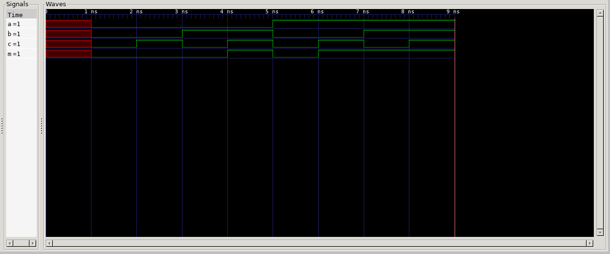
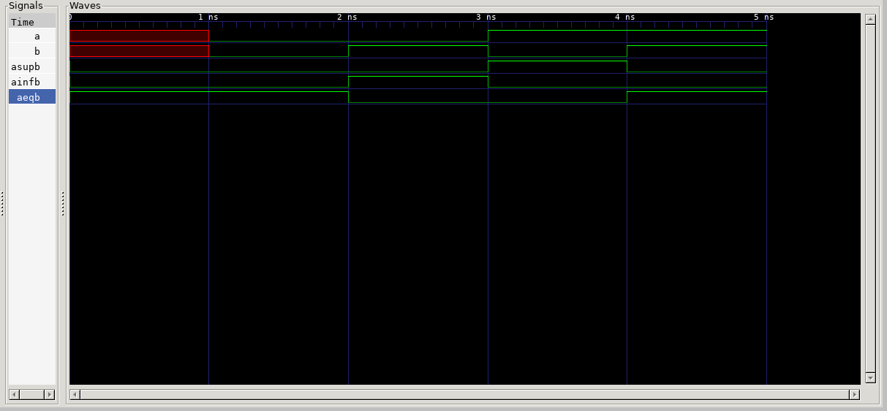
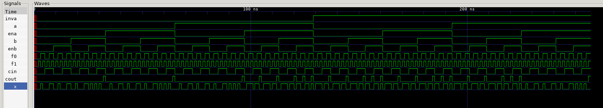
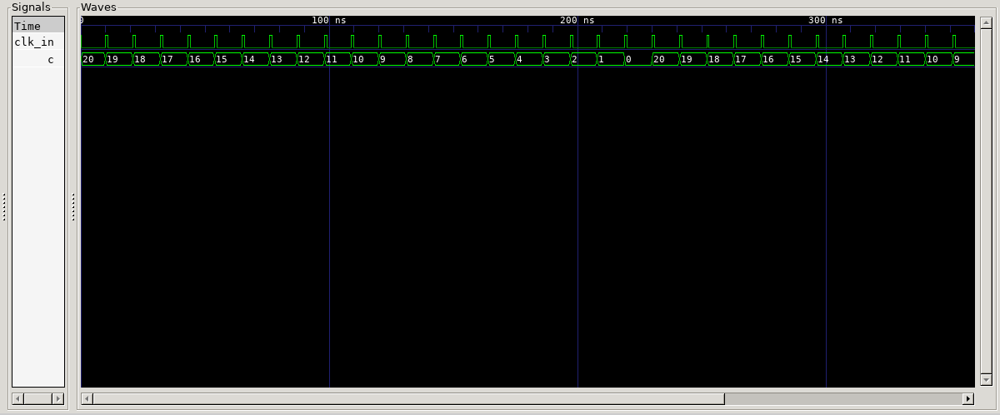
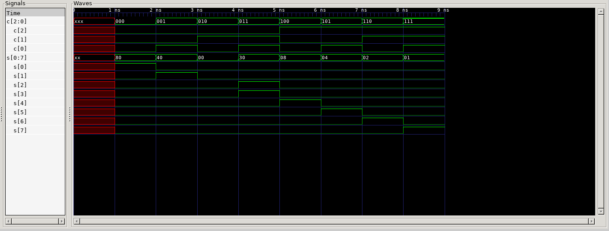

# EC Programmation Des Composants Embarqués – Langage VHDL

## Outils Utilisés
	Compilateur: GHDL
	Visualiseur de signaux: GTKWave

## Compilation et Visualisation

* Compilation et visualisation
```shell
make -C dossier_exerciceN

# ou si vous êtes dans un dossier d'exercice

make
``` 

* Nettoyage
```shell
make fclean -C dossier_exerciceN

# ou si vous êtes dans un dossier d'exercice

make fclean
``` 

## Explication Générale
* Chaque projet est composé de fichiers décrivants le circuit et les sous-circuits éventuelles et d'un fichier testbench permettant de donner les valeurs des signaux d'entrées et de générer les signaux de sorties utilisé par le logiciel de visualisation

* Les fichiers testbench donnent en général toutes les valeurs d'entrée possibles pour les entrées

* Sur chacun des images présentées , les valeurs des signaux d'entrées sont présentées sur les 1ères lignes et les dernières lignes servent à donner ceux des signaux de sortie.

## Exercice 1

Cette exercice donnait en exemple un circuit et son tableau de vérité
Après observation le circuit pouvait être décrit par la formule suivante qui suffisait d'écrire en VHDL: 
M = (! A ^ B ^ C) V (A ^ C ^ ! B) V (A ^ B ^ ! C) V (A ^ B ^ C).


## Exercice 2

Cette exercice n'est pas plus compliquée que la précédente.
3 bit en sorties ASUPB, AINFB, AEQB ont du être utilisées avec une structure conditionnelle avec "when".

## Exercice 3

Le circuit que l'on doit programmer (l'UAL) prends en entrée 8 signaux (INVA, A, ENA, B, ENB, CIN, F0, F1) et donnent 2 signaux en sorties (COUT, X). C'est un circuit complexe qui peut être diviser en 4 différentes parties l'unité logique, le décodeur, l'additionneur et le multiplexeur. Le code du circuit est donc divisé en 5 fichiers différents: 1 par sous-circuit ayant en entrée ses entrée et sorties propres + 1 pour le circuit générale possédant les entrées et sorties de tous le circuit.
La logique interne a donc été modularisé et le circuit générale ne fait qu'organiser les entrées et les sorties.


## Exercice 4

Dans cette exercice, le "décompteur front descendant" est écrit dans le fichier *dcounter.vhd* et le système d'horloge est écrit dans le *decoder_tb.vhd*.
Le système d'horloge génère un signal la plupart du temps à 0 mais qui a des pics à 1, un certain nombre de fois(il aurait possible de paramétrer le nombre de cycle avec une variable mais cela n'a pas été fait). Ce signal d'entrée sera reçu par le "décompteur" qui alors ne décomptera uniquement si la valeur du signal change à cause du block process(clk_in) et si la valeur du signal passe du 0 à 1 grâce au rising_edge.
Le valeur du compt est gardé par le "décompteur" et est initialisé à 20.

## Exercice 5

Comme l'exercice 1, la résolution de cette exercice n'est que la traduction de formule booléenne, sauf que cette fois les opérations sont effectuées sur un vecteur de bit en entrée et en sortie.
Sur l'image, c[2:0] et s[0:7] représente respectivement les vecteurs d'entrée et de sortie, les bits de chaques vecteur sont représentés en-dessous des lignes de ces 2 vecteurs.